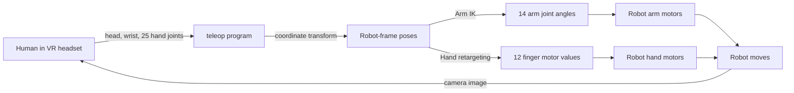
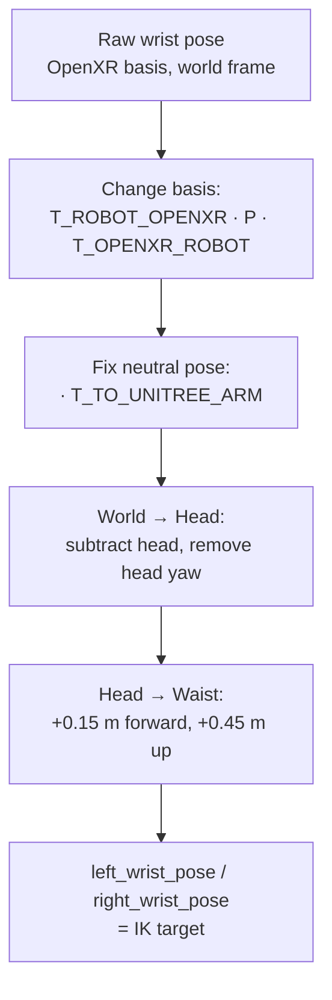
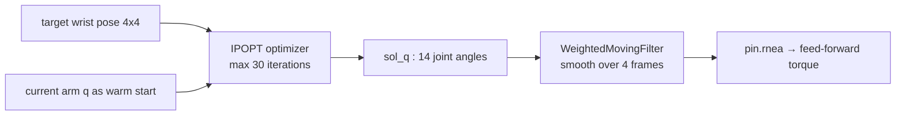
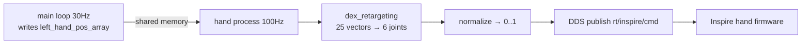

# Chapter 1 — How VR Teleoperation Works (G1 + 5‑Finger Inspire Hand)

> Goal of this chapter: explain, **from zero**, how a person wearing a VR
> headset can make the Unitree G1 robot copy their arm and finger motion.
> We follow the data from the VR glasses → through math → to the robot motors.
> Every step has a **simple number example** so you can explain it to anyone.

This document describes the code in
[teleop/teleop_hand_and_arm.py](../teleop/teleop_hand_and_arm.py) and the
helper modules it calls.

---

## 1.1 The 30‑second summary

You wear a VR headset (e.g. Meta Quest / Apple Vision Pro / PICO). The headset
already knows, 60+ times per second:

1. Where your **head** is in space.
2. Where your two **wrists** are in space.
3. Where **25 little points (joints) of each hand** are in space.

The teleop program **reads** these numbers over WiFi, **rotates them** into the
robot's way of describing space, then asks two questions:

- **Arm question:** "What 7 shoulder/elbow/wrist motor angles put the robot's
  hand where the human wrist is?" → solved by **Inverse Kinematics (IK)**.
- **Hand question:** "What 6 finger‑motor values make the robot fingers look
  like the human fingers?" → solved by **retargeting**.

The answers are angles (in radians). They are sent to the robot motors. The
robot moves. Meanwhile, the robot's camera image is sent **back** to the
headset so you see through the robot's eyes. This whole loop runs **30 times
per second**.



---

## 1.2 The big picture diagram (the main loop)

The heart of the program is the `while not STOP:` loop in
[teleop_hand_and_arm.py:285](../teleop/teleop_hand_and_arm.py#L285).
One pass through this loop = one "frame" of teleoperation (~33 ms).

```
                          ┌────────────────────────────────────────────┐
                          │            ONE LOOP (≈ 33 ms)                │
                          └────────────────────────────────────────────┘

  VR HEADSET                    teleop_hand_and_arm.py                 ROBOT
 ┌──────────┐                ┌───────────────────────────┐         ┌──────────┐
 │ head pose│  WiFi (Vuer)   │ tele_data =               │         │          │
 │ wrist ×2 │ ─────────────▶ │   tv_wrapper.get_tele_data│         │  G1 arm  │
 │ 25 hand  │   (HTTPS/WebXR)│                           │         │ 14 motors│
 │ joints×2 │                │ 1) transform to robot frame│        │          │
 │ pinch    │                │ 2) ARM IK  → sol_q (14)   │ ──DDS──▶│  Inspire │
 └──────────┘                │ 3) HAND retarget → q (12) │         │  hand    │
       ▲                     └───────────────────────────┘         │ 12 motors│
       │   robot camera image (ZMQ / WebRTC)                        └──────────┘
       └────────────────────────────────────────────────────────────────┘
```

Code skeleton of one loop:

```python
while not STOP:
    # (a) get camera image and send it to the VR headset
    head_img = img_client.get_head_frame()
    tv_wrapper.render_to_xr(head_img.bgr)

    # (b) READ the VR data (already transformed to robot frame)
    tele_data = tv_wrapper.get_tele_data()           # televuer/tv_wrapper.py

    # (c) push hand-joint points to the hand controller (runs in its own process)
    left_hand_pos_array[:]  = tele_data.left_hand_pos.flatten()
    right_hand_pos_array[:] = tele_data.right_hand_pos.flatten()

    # (d) read where the robot arm currently is
    current_lr_arm_q  = arm_ctrl.get_current_dual_arm_q()   # 14 numbers

    # (e) ARM: solve inverse kinematics for the two wrist target poses
    sol_q, sol_tauff = arm_ik.solve_ik(tele_data.left_wrist_pose,
                                       tele_data.right_wrist_pose,
                                       current_lr_arm_q, current_lr_arm_dq)

    # (f) send the solved angles to the arm motors
    arm_ctrl.ctrl_dual_arm(sol_q, sol_tauff)
```

The **hand** does not appear in step (e)/(f) because the hand controller runs in
a **separate process** and consumes `left_hand_pos_array` continuously on its
own — see §1.7.

---

## 1.3 What data actually comes from the VR? (the raw input)

The VR side is handled by **Vuer**, a WebXR server. The browser inside the
headset sends events to the file
[televuer/src/televuer/televuer.py](../teleop/televuer/src/televuer/televuer.py).

There are **two input modes** (chosen with `--input-mode`):

### Mode A — Hand tracking (`--input-mode hand`)  ← used for the 5‑finger hand

The headset cameras track your bare hands. Every `HAND_MOVE` event
(`on_hand_move`, [televuer.py:270](../teleop/televuer/src/televuer/televuer.py#L270))
delivers, **per hand**, an array of **25 joints**, each joint a full 4×4 pose
matrix (position + orientation). That is `25 × 16 = 400` numbers per hand.

The 25 joints follow the WebXR hand model:

```
 0  wrist
 1-4   thumb   (metacarpal → tip)
 5-9   index   (metacarpal → tip)
10-14  middle
15-19  ring
20-24  pinky
```

So **joint 4 = thumb tip, 9 = index tip, 14 = middle tip, 19 = ring tip,
24 = pinky tip, 0 = wrist**. Remember these numbers — the hand retargeting
(§1.7) uses exactly them.

From each joint matrix the code keeps:
- **position** (`hand_data[base+12..14]`) → `left_hand_positions` shape **(25,3)**
- **orientation** (the 3×3 rotation block) → `left_hand_orientations` shape **(25,3,3)**

It also reads simple **gesture states**:

| Field | Type | Meaning |
|---|---|---|
| `pinch` | bool | thumb + index touching |
| `pinchValue` | float (~15 → 0) | distance thumb↔index (0 = touching) |
| `squeeze` | bool | making a fist |
| `squeezeValue` | float 0→1 | how closed the fist is |

### Mode B — Controllers (`--input-mode controller`)

Instead of hands, you hold the VR controllers. `on_controller_move` gives the
wrist pose plus buttons: `trigger`, `squeeze`, `thumbstick`, `A/B`. This mode is
used to also **walk** the robot (thumbstick → velocity command). The 5‑finger
Inspire hand needs full finger tracking, so it requires **hand** mode.

### Always sent (both modes)

| Field | Shape | Source |
|---|---|---|
| `head_pose` | 4×4 | `on_cam_move` ("CAMERA_MOVE" event) |
| `left_arm_pose` (= left wrist) | 4×4 | hand or controller event |
| `right_arm_pose` (= right wrist) | 4×4 | hand or controller event |

All of these arrive in the **OpenXR convention** and in the **world frame**
defined by the headset. We must convert them — that is the next section.

---

## 1.4 The pose matrix — what is a 4×4 "SE(3)" and why

Every "pose" (head, wrist, each hand joint) is a **4×4 matrix** called a
*homogeneous transform* or *SE(3)*. It packs a **rotation** (3×3) and a
**position** (3×1) into one object:

```
        ┌                     ┐
        │  r11 r12 r13 │  px  │      R = 3×3 rotation (orientation)
   T =  │  r21 r22 r23 │  py  │      p = (px,py,pz) position in metres
        │  r31 r32 r33 │  pz  │
        │   0   0   0  │   1  │
        └                     ┘
```

Why this format? Because **chaining** and **inverting** motions becomes plain
matrix multiplication.

- To move a 3D point `v` by pose `T`: `v' = T · [v; 1]`.
- To compose "B after A": `T = T_B · T_A`.
- To invert (go backwards): `T⁻¹`. For a rigid transform there is a fast
  formula (used in the code as `fast_mat_inv`):

```
T⁻¹ = ┌ Rᵀ   −Rᵀ·p ┐          (transpose the rotation, rotate the negated position)
      └  0      1   ┘
```

**Tiny number example.** Suppose the human wrist is at position
`p = (0.3, 0.0, 1.1)` m with no rotation (`R = I`). Then

```
        ┌ 1 0 0 0.3 ┐
   T =  │ 0 1 0 0.0 │
        │ 0 0 1 1.1 │
        └ 0 0 0  1  ┘
```

If we want the wrist position *relative to the head* and the head is at
`(0,0,1.5)`, we compute `T_head⁻¹ · T_wrist`, which simply subtracts:
new position `= (0.3, 0.0, 1.1) − (0.0, 0.0, 1.5) = (0.3, 0.0, −0.4)`. The
wrist is 0.3 m to the right and 0.4 m below the eyes. That is exactly what
the code does in §1.6.

---

## 1.5 Coordinate conventions — the #1 source of confusion

The headset and the robot disagree about which axis is "up" and "forward".

```
   OpenXR (VR) convention            Robot / Unitree convention
   ─────────────────────            ──────────────────────────
        +Y up                              +Z up
         │                                  │
         │                                  │
         o───── +X right                    o───── +Y left
        /                                  /
      +Z (toward you / back)             +X (forward)
```

So before we can use VR numbers on the robot, we **rotate the basis**. The code
stores this as the constant matrix `T_ROBOT_OPENXR`
([tv_wrapper.py:137](../teleop/televuer/src/televuer/tv_wrapper.py#L137)):

```
            ┌  0  0 -1  0 ┐
T_ROBOT_    │ -1  0  0  0 │     reads: robot_X = -openxr_Z (VR "back"  → robot "forward")
  OPENXR =  │  0  1  0  0 │            robot_Y = -openxr_X (VR "right" → robot "left")
            └  0  0  0  1 ┘            robot_Z = +openxr_Y (VR "up"    → robot "up")
```

To convert a **whole pose** (which has both position and rotation) you must
sandwich it (a *similarity transform*):

> **`P_robot = T_ROBOT_OPENXR · P_openxr · T_OPENXR_ROBOT`**

where `T_OPENXR_ROBOT` is the inverse. Intuition for the sandwich:
1. right matrix: take the robot‑frame input, express it in VR axes,
2. middle matrix: apply the actual VR rotation,
3. left matrix: bring the result back into robot axes.

For a **bare 3D point** (like the 25 hand positions) there is no orientation to
rotate, so we only left‑multiply once: `p_robot = T_ROBOT_OPENXR · p_openxr`.

There is also a second, smaller correction. Even after fixing the *basis*, the
**neutral hand pose** of OpenXR is not the neutral pose of the Unitree URDF
(the robot's palm faces a different way). So the code right‑multiplies a fixed
"90° about X" matrix, `T_TO_UNITREE_HUMANOID_LEFT_ARM` /
`..._RIGHT_ARM`, to line up the initial pose
([tv_wrapper.py:122](../teleop/televuer/src/televuer/tv_wrapper.py#L122)).

> **Naming key** (used everywhere in `tv_wrapper.py`): a variable like
> `left_IPunitree_Brobot_waist_arm` reads as
> *left side · Initial‑Pose Unitree · Basis robot · expressed in waist frame · the arm*.
> `B...` = which axis convention, `IP...` = which neutral‑pose convention,
> and the middle word = the reference frame (world / head / waist).

---

## 1.6 From VR wrist → robot arm target (step by step, with numbers)

This all happens inside `get_tele_data()`
([tv_wrapper.py:284](../teleop/televuer/src/televuer/tv_wrapper.py#L284)). Here is
the wrist pipeline:



**Step 1 — basis change** (VR axes → robot axes): line 324–326.

**Step 2 — neutral‑pose fix** (line 332–333): `· T_TO_UNITREE_HUMANOID_LEFT_ARM`.

**Step 3 — world → head, then head → waist**
(`transform_IPunitree_Brobot_world_arm_to_head_then_waist`,
[tv_wrapper.py:103](../teleop/televuer/src/televuer/tv_wrapper.py#L103)).
The IK solver measures everything from a point near the robot's **waist motor**,
not from your eyes. So:

- subtract the head position (now the wrist is *relative to the head*);
- in default `head_yaw` mode, also undo how far you **turned your head left/right**
  (`R_head_yaw^T`), so that looking sideways does not drag the arms sideways;
- finally shift the origin from head down to waist:

```python
IPunitree_Brobot_waist_arm[0,3] += 0.15   # 0.15 m forward
IPunitree_Brobot_waist_arm[2,3] += 0.45   # 0.45 m up
```

**Worked number example (position only).**
Say after steps 1–2 the right wrist (robot axes, world frame) sits at
`p = (0.40, −0.20, 1.30)` m and the head is at `head = (0.10, 0.00, 1.55)` m,
head **not** rotated.

```
world → head :  p - head = (0.40-0.10, -0.20-0.00, 1.30-1.55) = (0.30, -0.20, -0.25)
head  → waist:  + (0.15, 0, 0.45)        = (0.45, -0.20,  0.20)
```

So the IK target is "the robot hand should be **0.45 m in front**, **0.20 m to
the right**, **0.20 m above** the waist." That 4×4 target is
`tele_data.right_wrist_pose`, fed straight into `solve_ik`.

---

## 1.7 Arm Inverse Kinematics (IK) — turning a target into 14 motor angles

File: [robot_control/robot_arm_ik.py](../teleop/robot_control/robot_arm_ik.py)
(class `G1_29_ArmIK`).

### The problem

- **Forward kinematics (easy):** given joint angles `q`, where is the hand?
  `pose = FK(q)`. Pure geometry, one answer.
- **Inverse kinematics (hard):** given a desired hand `pose`, find `q`.
  There may be many answers, or none exactly. We solve it as an
  **optimization**.

The G1 has 14 arm joints (7 per arm). We let those be the unknown vector
`q ∈ ℝ¹⁴`. We use **Pinocchio** (robot math) + **CasADi/IPOPT** (optimizer).

### The cost function (what "good" means)

[robot_arm_ik.py:147](../teleop/robot_control/robot_arm_ik.py#L147):

```python
minimize   50 · ‖position_error‖²      # hand should be at the target spot
         +  1 · ‖rotation_error‖²       # hand should point the right way
         + 0.02 · ‖q‖²                  # prefer small angles (stay natural)
         + 0.1 · ‖q − q_last‖²          # don't jump from last frame (smooth)
   subject to   q_low ≤ q ≤ q_high      # physical joint limits
```

Reading it in words:
- **Translational error** = (robot hand position from FK) − (target position).
  Weight **50** → this matters most: hit the target point.
- **Rotational error** = `log3( R_hand · R_targetᵀ )`. `log3` turns a rotation
  matrix into a 3‑vector "how many radians off about each axis"; it is 0 when
  the orientations match. Weight 1.
- **Regularization** `‖q‖²` keeps elbows from flying to weird angles.
- **Smoothness** `‖q − q_last‖²` keeps this frame near the last frame.



### Why a warm start?

`self.init_data = current_lr_arm_motor_q` ([line 255](../teleop/robot_control/robot_arm_ik.py#L255))
seeds the optimizer with where the arm already is, so it converges in a few
iterations (the loop must finish in ~33 ms). `warm_start_init_point: yes`.

### Mini IK intuition with a 2‑link arm (the math, simplified)

Real G1 IK is numeric, but the idea is exact for a 2‑link planar arm of
lengths `L1, L2` reaching point `(x, y)`:

```
cos(θ2) = (x² + y² − L1² − L2²) / (2·L1·L2)
θ2 = acos(...)                        # elbow angle
θ1 = atan2(y, x) − atan2(L2·sin θ2, L1 + L2·cos θ2)   # shoulder angle
```

Example: `L1 = L2 = 0.3 m`, target `(0.42, 0.0)`:
```
cos θ2 = (0.42² − 0.18) / (2·0.09) = (0.1764 − 0.18)/0.18 = −0.02 → θ2 ≈ 1.59 rad (≈91°)
```
So the elbow bends ~91°. The G1 solver does the same thing in spirit, but for
7 joints and with the four cost terms above instead of a closed formula.

### Output

`solve_ik` returns:
- `sol_q` — 14 joint angles (left 7 + right 7), after smoothing.
- `sol_tauff` — feed‑forward torque from inverse dynamics
  `pin.rnea(model, data, q, v=0, a=0)` (basically gravity compensation so the
  arm doesn't sag).

---

## 1.8 The smoothing filter (why the robot doesn't jitter)

VR tracking is a little noisy. After IK, `sol_q` passes through a
**WeightedMovingFilter**
([utils/weighted_moving_filter.py](../teleop/utils/weighted_moving_filter.py))
with weights `[0.4, 0.3, 0.2, 0.1]`. It is a weighted average of the last 4
frames:

```
q_smooth = 0.4·q[t] + 0.3·q[t-1] + 0.2·q[t-2] + 0.1·q[t-3]
```

The weights sum to 1.0 (checked by an assert). Newest frame counts most (0.4),
oldest least (0.1).

**Number example** for one joint over 4 frames `[1.00, 1.10, 0.90, 1.05]`
(newest first):
```
q_smooth = 0.4·1.00 + 0.3·1.10 + 0.2·0.90 + 0.1·1.05
         = 0.400 + 0.330 + 0.180 + 0.105 = 1.015 rad
```
The spikes are pulled toward the average → smooth motion, small lag.

---

## 1.9 Hand retargeting — 25 human points → 6 finger motors

File: [robot_control/robot_hand_inspire.py](../teleop/robot_control/robot_hand_inspire.py)
+ [robot_control/hand_retargeting.py](../teleop/robot_control/hand_retargeting.py)
+ config [assets/inspire_hand/inspire_hand.yml](../assets/inspire_hand/inspire_hand.yml).

The Inspire 5‑finger hand has **6 motors per hand**:

| motor idx | 0 | 1 | 2 | 3 | 4 | 5 |
|---|---|---|---|---|---|---|
| joint | pinky | ring | middle | index | thumb‑bend | thumb‑rotation |

We cannot send 25 points to 6 motors directly — we **retarget**. The library
`dex_retargeting` (DexPilot algorithm) does it.

### Step 1 — use *vectors between joints*, not raw positions

In `control_process`
([robot_hand_inspire.py:117](../teleop/robot_control/robot_hand_inspire.py#L117)):

```python
ref_left_value = left_hand_data[left_indices[1,:]] - left_hand_data[left_indices[0,:]]
```

`left_indices` comes from the YAML field `target_link_human_indices_dexpilot`:

```
row0 (origin): [ 9,14,19,24,14,19,24,19,24,24, 0, 0, 0, 0, 0]
row1 (task):   [ 4, 4, 4, 4, 9, 9, 9,14,14,19, 4, 9,14,19,24]
```

Each column is **one vector = point[row1] − point[row0]**. Recall the tip
indices (4=thumb, 9=index, 14=middle, 19=ring, 24=pinky, 0=wrist). So:

- columns 0–9 = **fingertip‑to‑fingertip** vectors (thumb→index, thumb→middle, …,
  index→middle, …). These capture *pinching / spreading*.
- columns 10–14 = **wrist‑to‑each‑fingertip** vectors (0→4, 0→9, 0→14, 0→19,
  0→24). These capture *how curled* each finger is.

Using **relative vectors** means the result does not depend on where your hand
is in the room — only on its *shape*. That's the whole trick.

### Step 2 — optimize robot finger joints to match those vectors

DexPilot solves a small optimization (conceptually):

```
minimize over robot finger joints  q_hand :
        Σ_i ‖ v_robot_i(q_hand) − α · v_human_i ‖²
```

i.e. make the **robot's** fingertip‑vectors match the **human's** vectors
(`α = scaling_factor = 1.20`, because the robot hand is a bit bigger).
`low_pass_alpha: 0.2` smooths the output. The result is an angle per
`target_joint_name`.

### Step 3 — reorder to hardware order

`retarget(...)` returns joints in URDF order; we index with
`left_dex_retargeting_to_hardware` to get the motor order
(pinky, ring, middle, index, thumb‑pitch, thumb‑yaw) the firmware expects
([hand_retargeting.py:63](../teleop/robot_control/hand_retargeting.py#L63)).

### Step 4 — normalize radians → [0,1] for the motor

The Inspire firmware wants **0.0 = fully closed, 1.0 = fully open**. The
retargeted values are radians. `normalize`
([robot_hand_inspire.py:130](../teleop/robot_control/robot_hand_inspire.py#L130)):

```python
def normalize(val, min_val, max_val):
    return np.clip((max_val - val) / (max_val - min_val), 0.0, 1.0)
```

Ranges: motors 0–3 use `[0, 1.7]`, motor 4 uses `[0, 0.5]`, motor 5 uses
`[−0.1, 1.3]`.

**Number example** — index finger (motor idx 3) comes out as `0.85 rad`:
```
normalize(0.85, 0.0, 1.7) = (1.7 − 0.85) / (1.7 − 0) = 0.85 / 1.7 = 0.5
```
→ `0.5` = finger half‑closed. If the human fully curls the finger (`1.7 rad`):
`(1.7−1.7)/1.7 = 0.0` = fully closed. If straight (`0 rad`):
`(1.7−0)/1.7 = 1.0` = fully open. 

For the **FTP** variant the [0,1] value is then scaled to `0–1000`
(`int(val*1000)`) because that firmware takes integers
([robot_hand_inspire.py:315](../teleop/robot_control/robot_hand_inspire.py#L315)).

### Why a separate process?

The hand controller (`Inspire_Controller_DFX`) is a `multiprocessing.Process`
that loops at **100 Hz** on its own, reading the shared array
`left_hand_pos_array` the main loop fills each frame. So fingers update faster
and independently of the 30 Hz arm loop. Communication is via
`multiprocessing.Array` (shared memory) guarded by locks.



---

## 1.10 Sending angles to the arm motors (the last step)

File: [robot_control/robot_arm.py](../teleop/robot_control/robot_arm.py).

`arm_ctrl.ctrl_dual_arm(sol_q, sol_tauff)` just stores the target; a background
thread `_ctrl_motor_state` (runs at high rate) actually writes to the motors via
**DDS**. Two safety/quality things happen there:

### (a) Velocity clipping — never move too fast

`clip_arm_q_target` ([robot_arm.py:158](../teleop/robot_control/robot_arm.py#L158)):

```python
delta        = target_q - current_q
motion_scale = max(|delta|) / (velocity_limit · control_dt)
clipped      = current_q + delta / max(motion_scale, 1.0)
```

If the requested jump is bigger than `velocity_limit · dt`, it is scaled down so
no joint exceeds the speed limit. `speed_gradual_max` ramps the limit up over
the first 5 seconds so startup is gentle
([robot_arm.py:191](../teleop/robot_control/robot_arm.py#L191)).

**Number example:** `current = 0.50`, `target = 0.80` (delta `0.30`),
`velocity_limit = 20 rad/s`, `dt = 1/250 s` → max allowed step `= 0.08`.
`motion_scale = 0.30/0.08 = 3.75`. Clipped target
`= 0.50 + 0.30/3.75 = 0.50 + 0.08 = 0.58`. So instead of jumping `0.30` this
frame, it moves the safe `0.08`, and catches up over the next frames.

### (b) PD control with feed‑forward torque

Each motor command carries `q` (target angle), `dq=0` (target velocity), and a
feed‑forward `tau`. The motor's onboard controller produces torque:

```
τ = kp · (q_target − q_actual) + kd · (0 − dq_actual) + tau_ff
```

`kp` (stiffness) and `kd` (damping) per joint are set at
[robot_arm.py:74](../teleop/robot_control/robot_arm.py#L74)
(`kp_high=300, kp_low=80, kp_wrist=40`, etc.). Big shoulder joints get high
stiffness; wrist gets low. `tau_ff` is the gravity compensation from IK so the
arm holds itself up.

---

## 1.11 Full data‑shape cheat sheet

| Stage | Variable | Shape | Units | Where |
|---|---|---|---|---|
| VR raw, per hand | hand joints | (25, 16) | matrices | `on_hand_move` |
| after extract | `left_hand_positions` | (25, 3) | metres, OpenXR | televuer.py |
| after transform | `tele_data.left_hand_pos` | (25, 3) | metres, robot/arm frame | tv_wrapper.py |
| VR wrist | `tele_data.left_wrist_pose` | (4, 4) | SE(3), waist frame | tv_wrapper.py |
| arm state | `current_lr_arm_q` | (14,) | radians | robot_arm.py |
| **arm IK out** | `sol_q` | (14,) | radians | robot_arm_ik.py |
| arm torque | `sol_tauff` | (14,) | N·m | robot_arm_ik.py |
| hand retarget | `left_q_target` | (6,) | 0–1 normalized | robot_hand_inspire.py |
| hand to motor (FTP) | scaled cmd | (6,) | 0–1000 int | robot_hand_inspire.py |

Per‑arm 7 joints = shoulder pitch/roll/yaw, elbow, wrist roll/pitch/yaw.
Two arms → 14. Each hand 6 motors → two hands = 12.

---

## 1.12 Why look through the robot's eyes?

The robot's head camera image is streamed **back** to the headset (ZMQ or
WebRTC) via `tv_wrapper.render_to_xr(...)`. In `immersive` display mode the
human sees only the robot's view → true first‑person teleoperation. This closes
the loop: you reach for what *the robot* sees, IK moves the arm, you see the
result, you adjust. (`--display-mode` chooses immersive / ego / pass‑through.)

---

## 1.13 End‑to‑end recap (one sentence per stage)

1. Headset measures head, wrists, and 25 hand joints (OpenXR, world frame).
2. `get_tele_data()` rotates them into robot axes and fixes the neutral pose.
3. Wrists are re‑expressed relative to the robot **waist** (the IK origin).
4. **Arm IK** optimizes 14 joint angles so the robot hand reaches each wrist.
5. A **moving‑average filter** smooths those angles.
6. In parallel, **hand retargeting** turns 25 points into 6 finger values/hand.
7. Finger values are **normalized** to 0–1 (then 0–1000 for FTP firmware).
8. Arm angles are **velocity‑clipped** and sent with **PD + gravity torque**.
9. The robot's camera view is streamed back to the headset; loop repeats 30×/s.

---

# 1.14 Questions & Answers (interview‑style, simple)

**Q1. In one line, what does this system do?**
It reads your head/hand motion from a VR headset and makes the G1 robot's arms
and fingers copy it in real time, while showing you the robot's camera view.

**Q2. What exactly comes from the VR headset?**
Three 4×4 poses (head + 2 wrists) and, per hand, 25 joint poses (so 25×3
positions + 25 orientations), plus pinch/squeeze gesture values. ~60 Hz.

**Q3. What is a 4×4 pose matrix?**
An SE(3) transform: a 3×3 rotation block + a 3×1 position, padded to 4×4. It
lets us rotate, translate, chain and invert motions by matrix multiplication.

**Q4. Why do we multiply by `T_ROBOT_OPENXR`?**
VR uses "Y‑up, Z‑back"; the robot uses "Z‑up, X‑forward". That matrix relabels
the axes. For full poses we sandwich `T · P · T⁻¹`; for bare points we multiply
once.

**Q5. Why subtract the head and add (0.15, 0, 0.45)?**
The IK origin is the robot's waist, not your eyes. Subtracting the head makes
the wrist relative to the head; the offset shifts the origin down/forward to the
waist motor.

**Q6. What does "head_yaw" reference mode do?**
It cancels how much you turned your head left/right, so looking around doesn't
swing the arms. It keeps pitch/roll but removes yaw of the head.

**Q7. What is inverse kinematics, simply?**
Forward kinematics: angles → hand position (easy, one answer). Inverse:
hand position → angles (hard, many/no answers). We solve it as an optimization
minimizing position error, rotation error, joint size and frame‑to‑frame jump.

**Q8. Why is position weighted 50 but rotation 1?**
Reaching the right *point* matters most for grasping; orientation is secondary,
so position error is penalized 50× harder.

**Q9. What are the regularization and smoothness terms for?**
`‖q‖²` keeps the pose natural/near zero; `‖q − q_last‖²` keeps this frame near
the previous one so the arm doesn't jerk.

**Q10. What does `pin.rnea` return and why?**
Inverse dynamics → the feed‑forward torque (mainly gravity compensation) so the
arm holds its weight and doesn't droop.

**Q11. Why a moving‑average filter after IK?**
VR tracking is noisy; averaging the last 4 solutions
(`0.4,0.3,0.2,0.1`) removes jitter with little lag.

**Q12. How do 25 hand points become 6 finger motors?**
We build ~15 *vectors between joints* (fingertip‑to‑fingertip and
wrist‑to‑fingertip), then DexPilot optimizes the 6 robot finger joints to match
those vectors (scaled by 1.2). Then reorder + normalize to 0–1.

**Q13. Why use vectors between joints instead of raw positions?**
Because vectors describe the *shape* of the hand independent of where it is in
the room — pose‑invariant, so it generalizes.

**Q14. Explain the normalize formula.**
`(max − val)/(max − min)`, clipped to [0,1]. Big angle (curled) → near 0
(closed); small angle (straight) → near 1 (open). It maps radians to the
firmware's open/closed scale.

**Q15. Why does the hand run in a separate process at 100 Hz?**
So fingers respond faster and independently of the 30 Hz arm loop; the main loop
just writes the 25 points into shared memory.

**Q16. What stops the arm from moving dangerously fast?**
`clip_arm_q_target` scales any too‑large joint step down to the velocity limit,
and `speed_gradual_max` ramps that limit up over the first 5 seconds.

**Q17. What is the PD + feed‑forward torque equation?**
`τ = kp·(q_target − q) + kd·(0 − dq) + tau_ff`. kp = stiffness, kd = damping,
tau_ff = gravity compensation from IK.

**Q18. How does the human see what to do?**
The robot's head camera is streamed back to the headset (immersive mode), giving
first‑person view, closing the perception–action loop.

**Q19. Hand mode vs controller mode?**
Hand mode tracks bare fingers (needed for the 5‑finger Inspire hand). Controller
mode uses buttons/thumbstick (also lets you walk the robot) but can only drive
grippers, not individual fingers.

**Q20. What's the frequency of the main loop and why?**
30 Hz (`--frequency 30`). Fast enough to feel responsive, slow enough that IK
(max 30 iterations) and image handling finish inside the ~33 ms budget.

**Q21. What is DDS here?**
The real‑time middleware (`unitree_sdk2py`) that carries motor commands/states
between the program and the robot, and the hand commands on topics like
`rt/inspire/cmd`.

**Q22. If tracking briefly fails, what happens?**
`safe_mat_update` checks the matrix determinant; if invalid it keeps the
previous pose and flags it invalid (falls back to a constant default pose), so
the robot doesn't lurch.

---

## 1.15 Glossary

| Term | Meaning |
|---|---|
| **OpenXR / WebXR** | Standard for VR tracking data (poses, hands). |
| **Vuer** | Web server that streams the headset data to Python and images back. |
| **SE(3) / pose** | 4×4 rotation+translation matrix. |
| **FK / IK** | Forward / Inverse Kinematics (angles↔hand pose). |
| **Pinocchio** | C++/Python rigid‑body dynamics library (FK, Jacobians, RNEA). |
| **CasADi / IPOPT** | Symbolic math + nonlinear optimizer used to solve IK. |
| **RNEA** | Recursive Newton–Euler — computes joint torques (gravity comp). |
| **Retargeting / DexPilot** | Mapping human hand shape to robot finger joints. |
| **DDS** | Real‑time pub/sub middleware to talk to robot motors. |
| **kp / kd** | Position / velocity gains of the motor PD controller. |
| **q / dq / tau** | Joint angle / angular velocity / torque. |

---

*Next chapter idea: trace a single grasp end‑to‑end with real logged numbers, and
cover the recording/dataset pipeline (`EpisodeWriter`).*
